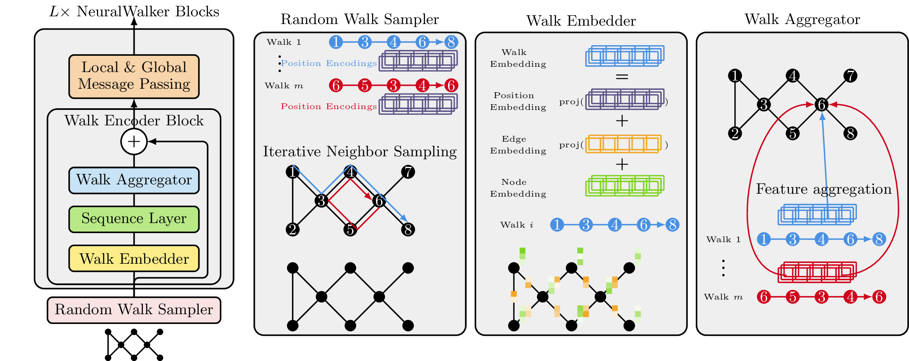

# :walking: NeuralWalker

The repository implements the NeuralWalker in [Pytorch Geometric][1] described in the following paper

>Dexiong Chen, Till Schulz, and Karsten Borgwardt.
[Learning Long Range Dependencies on Graphs via Random Walks][2], Preprint 2024.

**TL;DR**: A novel random-walk based neural architecture for graph representation learning.

## :book: Overview



NeuralWalker samples random walks with a predefined sampling rate and length, then uses advanced sequence models to process them. 
Additionally, local and global message passing can be employed to capture complementary information.
The main components of NeuralWalker are a random walk sampler, and a stack of neural walker blocks (a walk encoder block + a message passing block).
Each walk encoder block has a walk embedder, a sequence layer, and a walk aggregator.

- Random walk sampler: samples m random walks independently without replacement.
- Walk embedder: computes walk embeddings given the node/edge embeddings at the current layer.
- Sequence layer: any sequence model, e.g. CNNs, RNNs, Transformers, or state-space models.
- Walk aggregator: aggregates walk features into node features via pooling of the node features encountered in all the walks passing through that node.

## :hammer_and_wrench: Installation

We recommend the users to manage dependencies using [miniconda](https://docs.conda.io/projects/miniconda/en/latest) or [micromamba](https://mamba.readthedocs.io/en/latest/installation/micromamba-installation.html):

```bash
# Replace micromamba with conda if you use conda or miniconda
micromamba env create -f environment.yaml 
micromamba activate neuralwalker
pip install -e .
```

> [!NOTE]
> Our code is also compatible with more recent Pytorch versions, your can use `micromamba env create -f environment_latest.yaml` for development purposes.

> [!TIP]
> NeuralWalker relies on a sequence model to process random walk sequences, such as CNNs, Transformers, or state-space models. If you encounter any issues when installing the state-space model [Mamba](https://github.com/state-spaces/mamba),
> please consult its installation guideline.

## :bulb: Reproducing results

### Running NeuralWalker on Benchmarking GNNs, LRGB, and OGB

All configurations for the experiments are managed by [hydra](https://hydra.cc/), stored in `./config`.

Below you can find the list of experiments conducted in the paper:

- [Benchmarking GNNs](https://pytorch-geometric.readthedocs.io/en/latest/generated/torch_geometric.datasets.GNNBenchmarkDataset.html#torch_geometric.datasets.GNNBenchmarkDataset): zinc, mnist, cifar10, pattern, cluster
- [LRGB](https://pytorch-geometric.readthedocs.io/en/latest/generated/torch_geometric.datasets.LRGBDataset.html#torch_geometric.datasets.LRGBDataset): pascalvoc, coco, peptides_func, peptides_struct, pcqm_contact
- [OGB](https://ogb.stanford.edu/docs/graphprop/): ogbg_molpcba, ogbg_ppa, ogbg_code2

```bash
# You can replace zinc with any of the above datasets
python train.py experiment=zinc

# Running NeuralWalker with a different model architecture
python train.py experiment=zinc experiment/model=conv+vn_3L
```

> [!TIP]
> You can replace `conv+vn_3L` with any model provided in `config/experiment/model`, or a customized model by creating a new one in that folder.

### Running NeuralWalker on node classification tasks

We integrate NeuralWalker with Polynormer, SOTA model for node classifcation. See [node_classifcation](./node_classification) for more details.


### Debug mode

```bash
python train.py mode=debug
```


[1]: https://pytorch-geometric.readthedocs.io/
[2]: 